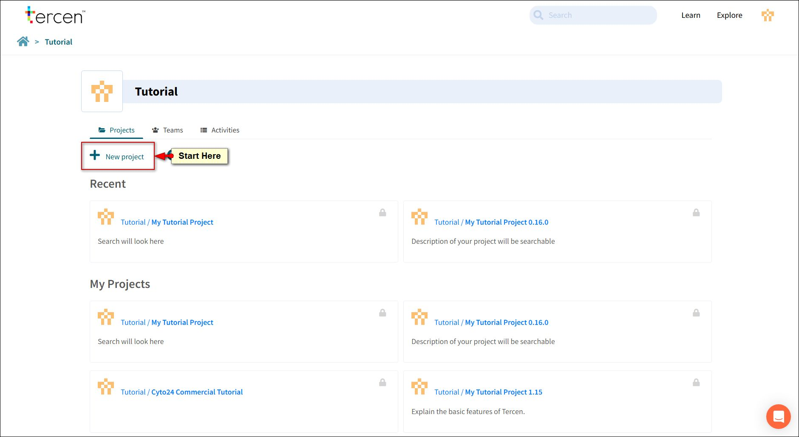
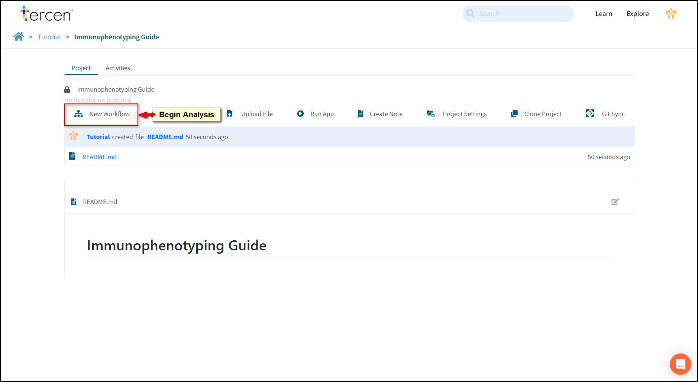
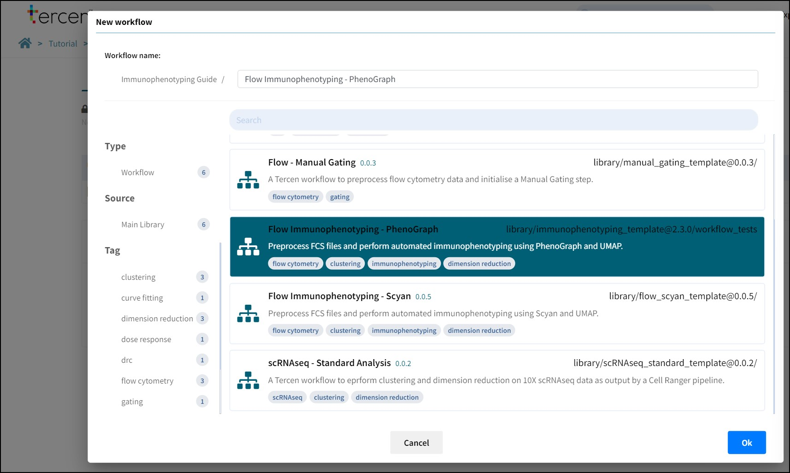
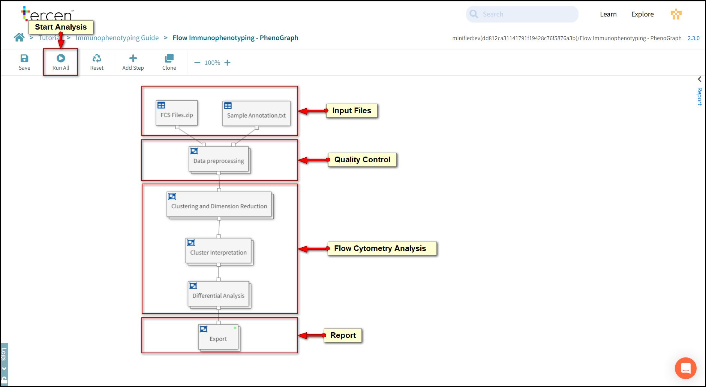
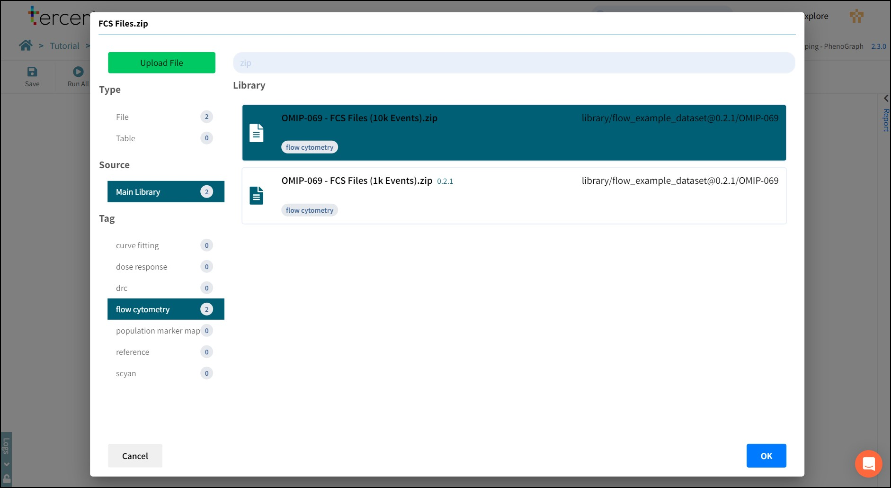
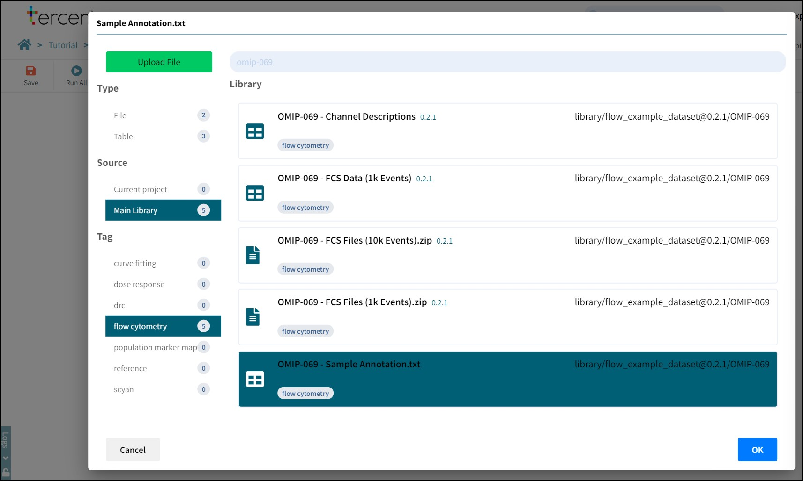
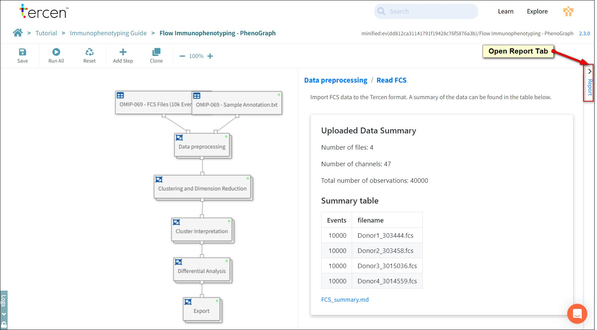

# How to use the template

This tutorial explains how to start a project and run the immunophenotyping template.

Templates are pre-defined workflows that are saved into Tercen for quick loading.

They provide standardisation of analysis and help make experiments reproducible.

This chapter will use pre-prepared data (FCS files and an annotation file) to demonstrate the concepts.

## Create a project

Click the **+ New project** Button.

Name it "Immunophenotyping Guide".

Press OK.

## New workflow

To begin an analysis click **New Workflow**.

Choose - **Flow Immunophenotyping - Phenograph**.

Press Ok.

## Run an analysis

The workflow canvas will show the immunophenotyping workflow.

It has sections to perform different functions.

- Importing files.
- Quality Control and Normalisation of Data.
- Analysis algorithms for clustering and dimension reduction.
- Reports.

Press **Run All** to begin analysis.

Tercen will ask you to assign files to be analysed.

Sample files have been uploaded in advance to the Tercen Library.

Use the *Main Library* and *flow cytometry* tags to narrow down the selection.

Choose ***OMIP=-69 - FCS Files (10k Events).zip***.

Press OK.

This Template uses an annotation file to describe treatment conditions.

Use the Tags and search bar to find and select ***OMIP-069 - Sample Annotation.txt***.

Press OK.

The workflow will begin analysis.

It will show a spinning icon on each step as it is being processed.

When a step has finished it will display a Green Dot.

When the workflow has completed all analysis blocks **Save** the workflow.

## Report Tab

Click the report tab to open the analysis results.

*Note: Graphs can be enlarged on screen by clicking on them.*

Each analysis block in the workflow will generate multiple results.

### Data Pre-processing

- Read FCS (information on the files, channels and events).
- Channel Names and descriptions.
- Event Count.
- Marker Distribution (logicle).
- Marker Distribution (z value).

### Clustering and Dimension Reduction

- View Clusters on UMAP.
- UMAP coloured by file.
- UMAP coloured by condition.
- UMAP vs. Marker Expression.

### Cluster Interpretation

- Ordered enrichment heatmap.
- Cluster markers.
- Cluster profiles.

### Differential Analysis

- Cluster proportions per sample.
- Cluster proportions across conditions.
- UMAP across conditions.

### Export

- Export Report as PDF.
- Export Report as Power Point Slides.
- Export FCS files with UMAP and Clusters.

*NB: Individual graphs or tables can be downloaded by clicking the link below them.*
