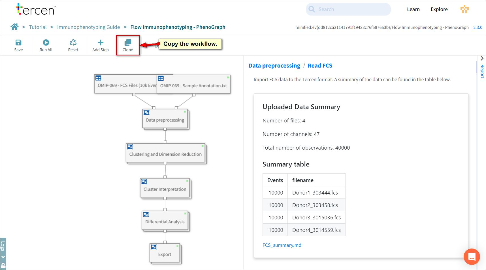
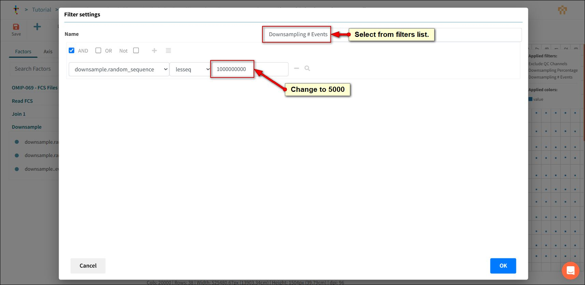
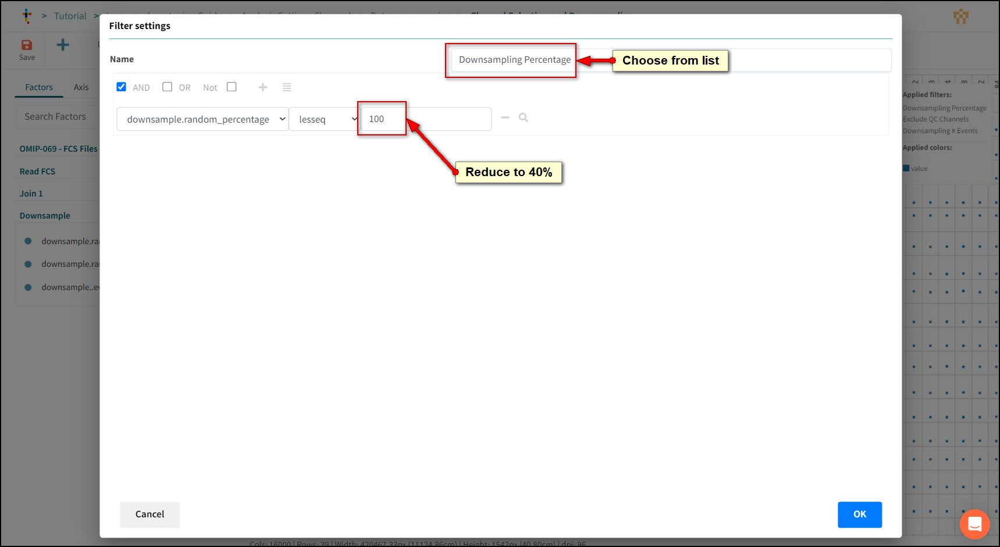

# Downsampling

Downsampling is the process of reducing the amount of data for analysis. This is done by systematically selecting a subset of the data at a lower rate than the original.

Downsampling can give you a quick analysis result by processing less data. Useful for forming an opinion on how the data looks before submitting the full amount for a long running calculation.

Downsampling can also balance an analysis across samples which do not have the same number of data points.

In this lesson we will open analysis blocks and adjust relevant settings to control how many events are included in the analysis.

We will set up browser tabs to review how they impact the visualisations.

## Clone the workflow

In order to compare our changes to the original we will clone the workflow.

Press the Clone Button.

Click **Next** to select the team.

Click **Next** to select the project.

>:bulb:
If you have followed this tutorial you should not have to change the automatic suggestions. Be aware that if you created this tutorial into a Team then you may have to change selections here.

Rename the workflow to "Analysis Settings Changed".

Press OK.

Right click the Immunophenotyping Guide link in the breadcrumb.

Select "Open in a new Tab".

Click the **Flow Immunophenotyping - Phenograph** link to open it.

Now you can change tabs on your browser to compare changes.

## Open the Filter

Working From the Analysis Settings Changed workflow.

Double Click the **Data pre-processing** box.

The view panel will open.

Choose **Channel Selection and Downsampling**

The data step will open again.

>:bulb:
The data step should be already reset from our last exercise but press the reset button if it is visible.

Downsampling is controlled by two types of filter.

One reduces based to a chosen number of events, while the other to a percentage of the original dataset.

Normally only one of these needs to be adjusted. Choose the filter that best represents your needs.

## Downsampling # Events

This is a whole number setting for the maximum events to be included from each file.

Files with less events than the setting will have all events included and files with more will be restricted.

To modify this filter, click the chevron on the filters section and select **Downsampling # Events**.

Change the value to **5000**.

## Downsampling Percentage

This is a proportionate setting for the maximum events to be included from each file.

This setting takes a balanced approach based on the file with smallest number of events.

For example.

If there are two FCS files. One with 1000 events and one with 10000 events and the downsampling is set to 80%.

Both files will be reduced to 800 events for calculation. The smaller file dictates the number calculated.

To modify this filter, click the chevron on the filters section and select **Downsampling # Events**.

Change the value to **40**.

