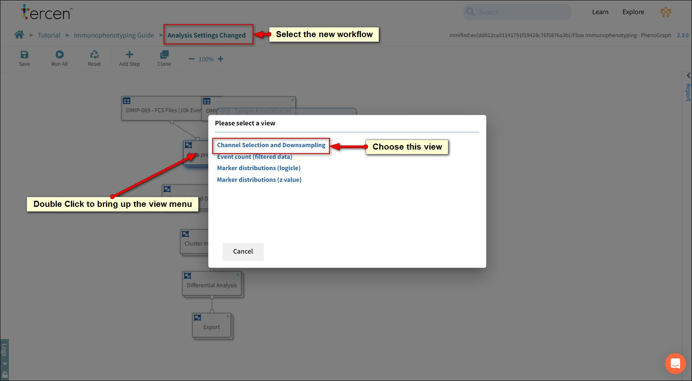
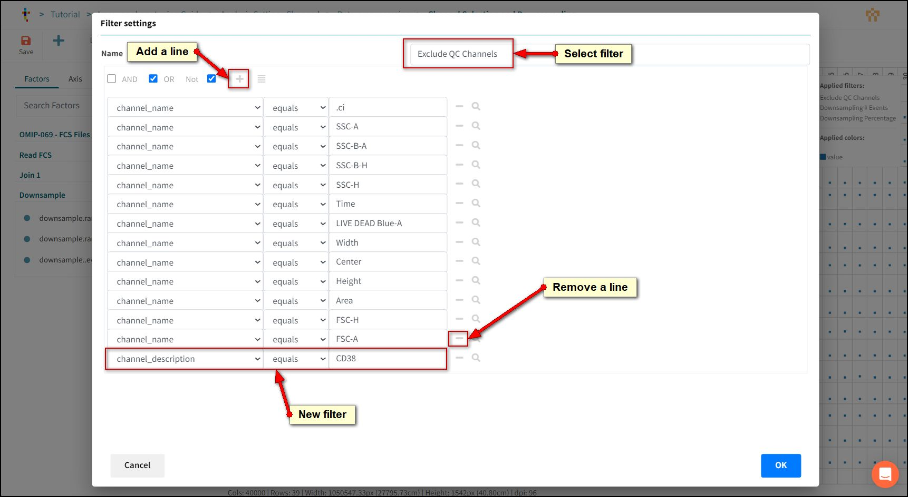
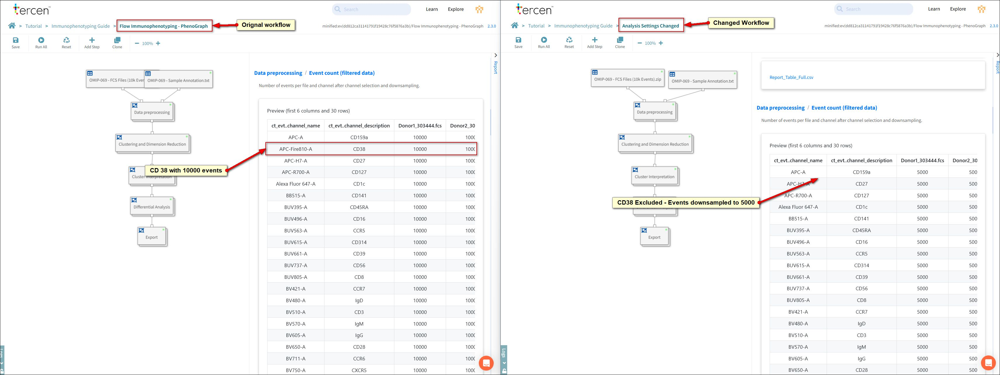

# Adjusting Channels

Tercen uses filters to control which instrument measurements are included in an analysis. This immunophenotyping workflow is built to exclude measurements that are typically not used in Flow Cytometry analysis (such as Time and Scatter).

To further exclude uninteresting channels follow this procedure.

## Open the Filter

Select the **Analysis Settings Changed** workflow on your browser tab.

Double Click the **Data pre-processing** box.

The view panel will open.

Choose **Channel Selection and Downsampling**.

A data step will open.

## Remove a Channel

Press the **Reset** button to allow us to modify settings.

Hover on the **Filters** drop zone with your mouse, the list of existing filters will appear.

Select *Exclude QC channels*.

Exclude QC channels is a filter that excludes channels from the analysis.

To remove a channel from the analysis we add it to the exclusion list.

We will exclude CD38.

Press the **plus (+)** button.

A new line will be created.

- Factor = Channel_description.
- Logic = equals.
- Definition = CD38.

*Note: You can click the search icon beside a line to look up any available values in the filter definition.*

>:bulb:
To reverse an exclusion and add the channel back into the analysis click the minus button to remove the line.

Press OK.

Press Save.

Return to **Analysis Settings Changed** workflow using the Breadcrumb.

You will notice the green dots have disappeared from the analysis steps. Tercen knows the changes to the filters will affect downstream calculations so has reset them.

We will not re-run the workflow just yet. Instead we will down-sample our data.

## Re-Run the Workflow

Press OK.

Press Save.

Return to **Analysis Settings Changed** workflow using the Breadcrumb.

Press **Run All**.

## Compare changes

Press Save on the workflow.

Using the tabs on your browser open the report window in both workflows.

Compare **Event Count (filtered data)** for the changes made with Downsampling and the Channels excluded.

