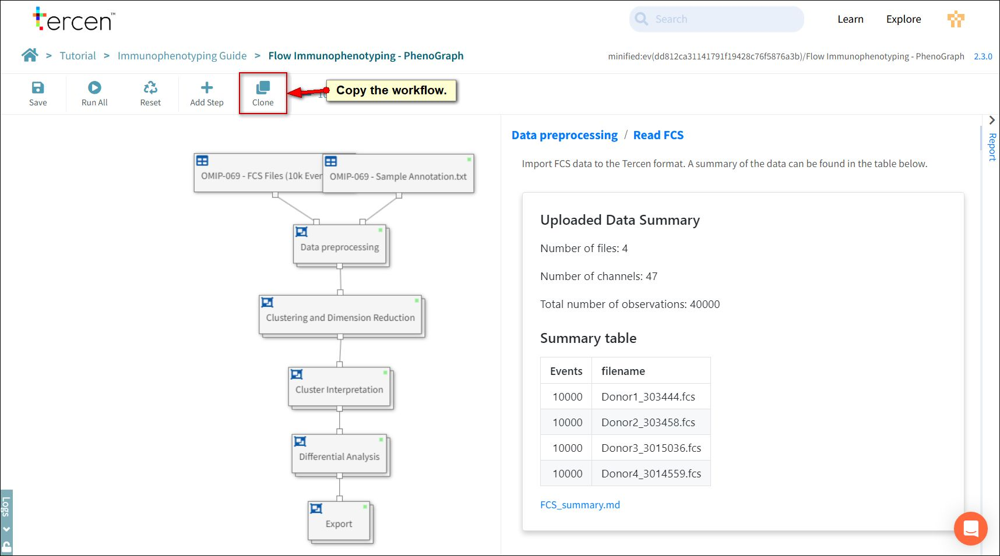
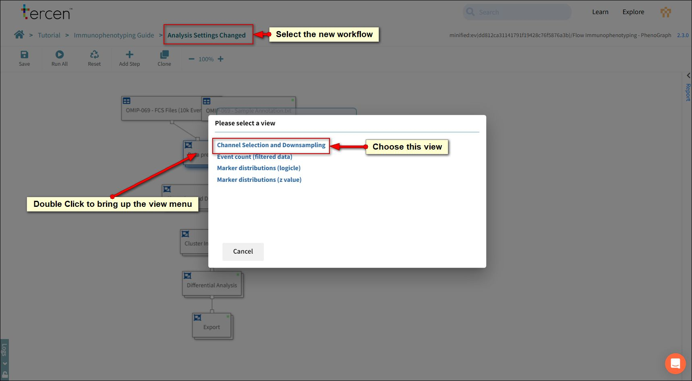
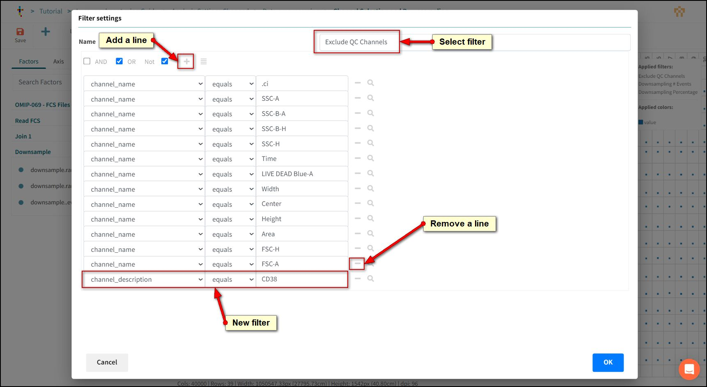

# Adjusting Events and Channels

In this lesson we will open analysis blocks and adjust relevant settings to control which channels and events are included in the analysis.

We will set up browser tabs to review how they impact the visualisations.

## Clone the workflow

In order to compare our changes to the original we will clone the workflow.

Press the Clone Button

Click **Next** to select the team.

Click **Next** to select the project

*Note: If you have followed this tutorial you should not have to change the automatic suggestions. Be aware that if you created this tutorial into a Team then you may have to change selections here.*

Rename the workflow to "Analysis Settings Changed".

Press OK

Right click the Immunophenotyping Guide link in the breadcrumb.

Select "Open in a new Tab"

Click the **Flow Immunophenotyping - Phenograph** link to open it.

Now you can change tabs on your browser to compare changes.

## Adjust Channels in the analysis

Select the **Analysis Settings Changed** workflow on your browser tab.

Double Click the **Data pre-processing** box.

The view panel will open.

Choose **Channel Selection and Downsampling**

A data step will open.

### Remove a Channel

Press the **Reset** button to allow us to modify settings.

Hover on the **Filters** drop zone with your mouse, the list of existing filters will appear.

Select *Exclude QC channels*.

Exclude QC channels is a filter that excludes channels from the analysis.

To remove a channel from the analysis we add it to the exclusion list.

We will exclude CD38

Press the **plus (+)** button.

A new line will be created.

- Factor = Channel_description.
- Logic = equals.
- Definition = CD38.

*Note: You can click the search icon beside a line to look up an=y available values in the filter definition.*

To reverse an exclusion and add the channel back into the analysis click the minus button to remove the line.

Press OK.

Press Save.

Return to **Analysis Settings Changed** workflow using the Breadcrumb.

You will notice the green dots have disappeared from the analysis steps. Tercen knows the changes to the filters will affect downstream calculations so has reset them.

We will not re-run the workflow just yet. Instead we will down-sample our data.

## Downsampling

Downsampling is the process of reducing the amount of data for analysis. This is done by systematically selecting a subset of the data at a lower rate than the original.

Downsampling can give you a quick analysis result by processing less data. Useful for forming an opinion on how the data looks before submitting the full amount for a long running calculation.

Downsampling can also balance an analysis across samples which do not have the same number of data points.

Working From the Analysis Settings Changed workflow.

Double Click the **Data pre-processing** box.

The view panel will open.

Choose **Channel Selection and Downsampling**

The data step will open again.

*Note: The data step should be already reset from our last exercise but press the reset button if it is visible.*

Press the Reset button to allow us to modify settings.

Downsampling is controlled by two types of filter.

One reduces based on events and the other based on percentage.

Normally only one of these needs to be adjusted. Choose the filter that best represents your needs.

### Downsampling # Events

This is a whole number setting for the maximum events to be included from each file.

Files with less events than the setting will have all events included and files with more will be restricted.

To modify.

Click the chevron on the filters section and select **Downsampling # Events**.

Change the value to **5000**

### Downsampling Percentage

This is a proportionate setting for the maximum events to be included from each file.

This setting takes a balanced approach based on the file with smallest number of events.

For example.

If there are two FCS files. One with 1000 events and one with 10000 events and the downsampling is set to 80%.

Both files will be reduced to 800 events for calculation. The smaller file dictates the number calculated.

To modify.

Click the chevron on the filters section and select **Downsampling Percentage**.

Change the value to **40**

## Re-Run the Workflow

Press OK.

Press Save.

Return to **Analysis Settings Changed** workflow using the Breadcrumb

Press **Run All**

## Compare changes

Press Save on the workflow

Using the tabs on your browser open the report window in both workflows.

Compare **Event Count (filtered data)**.

