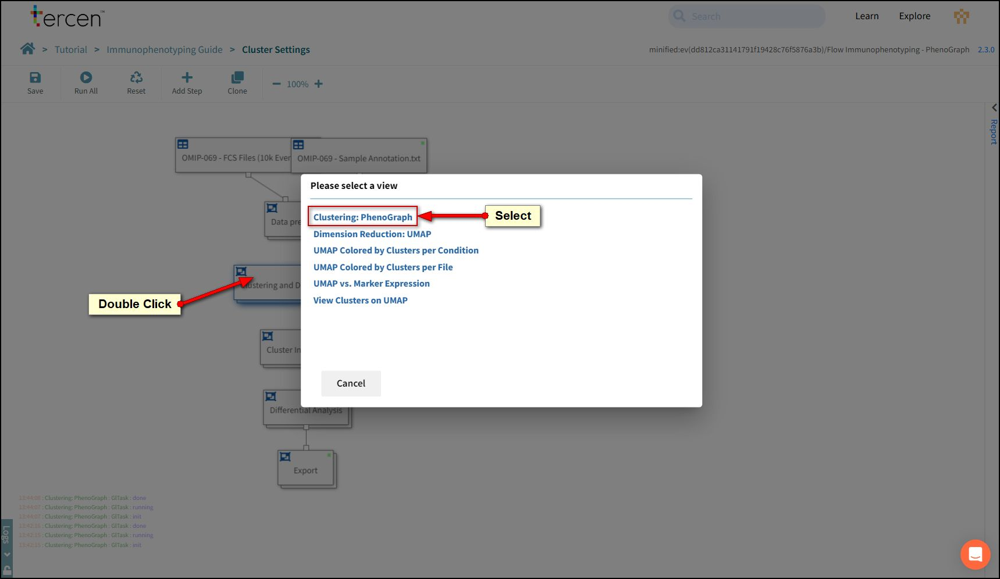
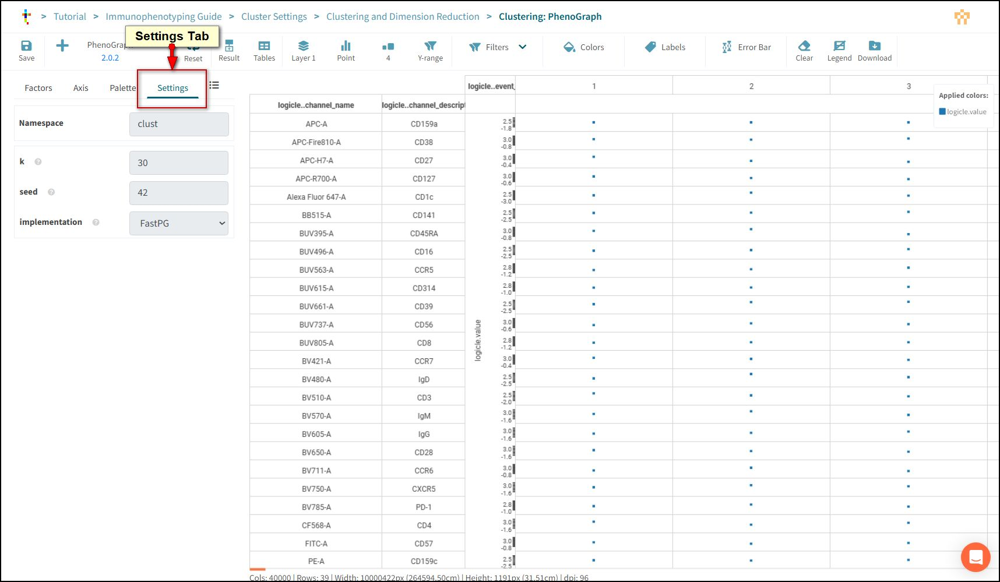

# Working with Clusters

This chapter explains the settings that control the clusters found by the Phenograph algorithm.

## Clone the workflow

Take another copy of the original workflow.

Press the Clone Button.

Click **Next** to select the team.

Click **Next** to select the project.

*Note: If you have followed this tutorial you should not have to change the automatic suggestions. Be aware that if you created this tutorial into a Team then you may have to change selections here.*

Rename the workflow to "Cluster Settings".

Press OK.

Right click the Immunophenotyping Guide link in the breadcrumb.

Select "Open in a new Tab".

Click the **Flow Immunophenotyping - Phenograph** link to open it.

Now you can change tabs on your browser to compare changes.

## Adjusting Phenograph

PhenoGraph is a graph-based clustering algorithm that constructs a k-nearest neighbour graph. It is widely used for high-dimensional single-cell data analysis.

Select the **Cluster Settings** workflow on your browser tab.

Double Click the **Clustering and Dimension Reduction** box.

The view panel will open.

Choose **Clustering: Phenograph**.

A data step will open.

Press **Reset** to allow modification.

Open the **Settings Panel** by clicking the tab.

### k value

This is the stringency parameter it adjust how clusters will appear on any visualisation.

This can help with defining separation from other clusters.

A higher value means larger clusters.

A lover value means smaller clusters.

Set **k** to 15.

### Seed

Controls randomness in the calculations made by the algorithm.

By re-running the algorithm with different seed values you can test how reliably it is finding clusters. If different seed values still produce the same graph then the algorithm is stable.

Set **seed** to 29.

*We will adjust UMAP setting before checking the results of our changes.*
