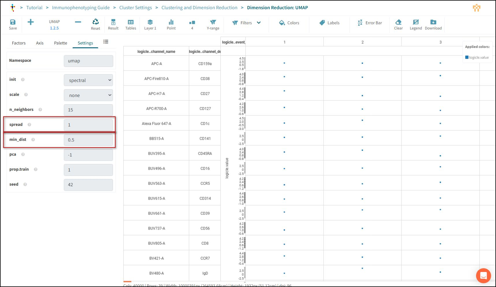

# UMAP

UMAP (Uniform Manifold Approximation and Projection) is a nonlinear dimensionality reduction technique that preserves global and local structures, making it useful for visualizing high-dimensional data.

## Open the Filter

Double Click the **Clustering and Dimension Reduction** box.

The view panel will open.

Choose **Dimension Reduction: UMAP**

A data step will open.

Press **Reset** to allow modification.

Open the **Settings Panel** by clicking the tab.

Two settings influence how clumped together or separated the clusters are in the visualisation.

### Spread

Set spread to 2

## min-dist

Set min-dist to 0.75

*Note: UMAP also uses a seed to control randomness. You can perform the same stability checks for UMAP with this setting.

Press **Save**.

## Configure how plots appear

Tercen allows you to change colour palettes and labels on graphs.

Select the **Cluster Settings** workflow on your browser tab.

Double Click the **Clustering and Dimension Reduction** box.

The view panel will open.

Choose **UMAP vs. Marker Expression**

Prese **Reset** to allow modification.

### Plot Layout Settings

In the settings tab.

Change title to "UMAP Marker - Jet"

Change **xlab** to "UMAP A"

Change **ylab** to "UMAP B"

There are other settings for sizes, fonts and notation.

### Colour Palette

Select the *Palette** tab.

Change the palette to "Jet".

Press **Save**

## Re-Run the Workflow

Return to **Cluster Settings** workflow using the Breadcrumb

Press **Run All**

Press Save.

## Compare changes

Using the tabs on your browser open the report window in both workflows.

Compare how the visualisations have changed from the original.

Graphs to compare.

- UMAP by PhenoGraph Cluster.
- UMAP vs. Marker Expression.
