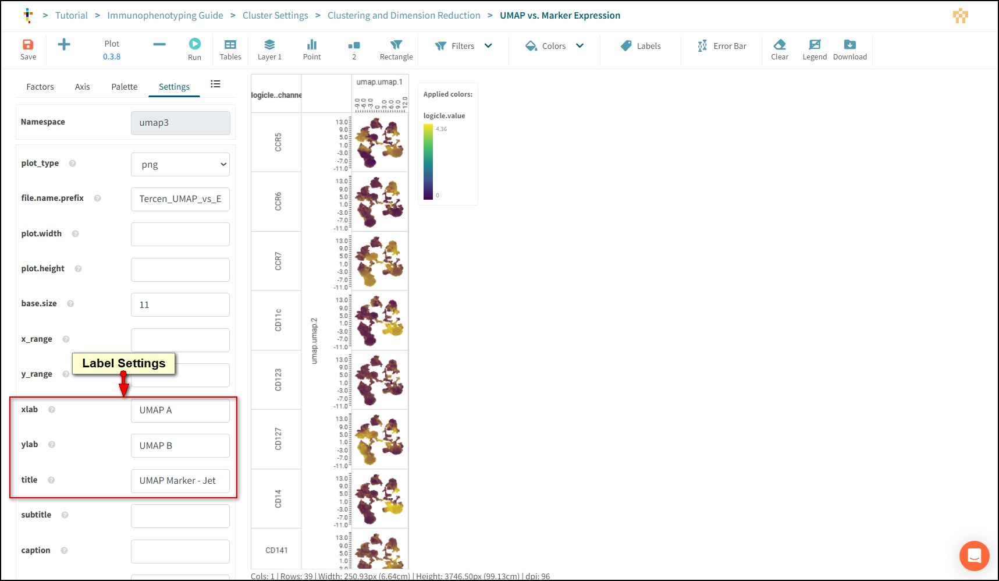

# Configure Plot Appearance

Tercen allows you to change settings on the Plot Operator to customise how graphs appear. This includes, sizes, colour palette, and labels.

## Open the Plot Step

Select the **Cluster Settings** workflow on your browser tab.

Double Click the **Clustering and Dimension Reduction** box.

The view panel will open.

Choose **UMAP vs. Marker Expression**.

Prese **Reset** to allow modification.

## Plot Layout Settings

In the settings tab.

Change title to "UMAP Marker - Jet".

Change **xlab** to "UMAP A".

Change **ylab** to "UMAP B".

There are other settings for sizes, fonts and notation.

## Colour Palette

Select the *Palette** tab.

Change the palette to "Jet".

Press **Save**.

## Re-Run the Workflow

Return to **Cluster Settings** workflow using the Breadcrumb.

Press **Run All**

Press Save.

## Compare changes

Using the tabs on your browser open the report window in both workflows.

Compare how the visualisations have changed from the original.

Graphs to compare.

- UMAP by PhenoGraph Cluster.
- UMAP vs. Marker Expression.
