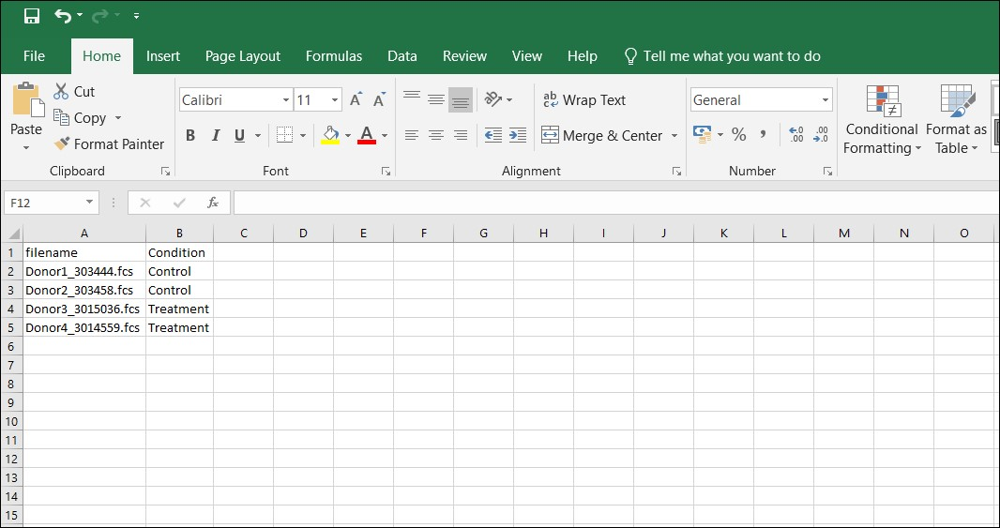
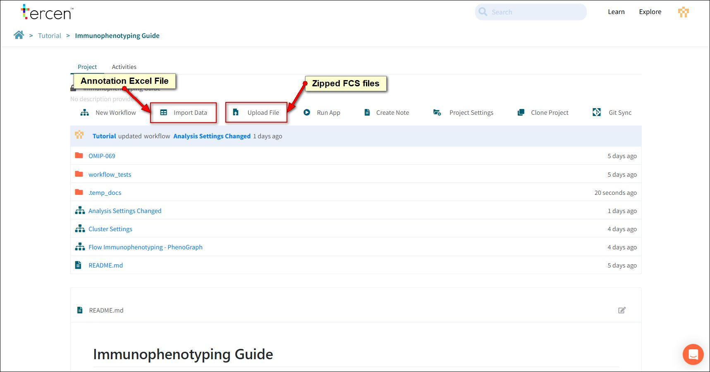

# Using your own files

This chapter explains how to use your own FCS siles with the Immunophenotyping - Phenograph template.

## ZIP the FCS files

Compress all FCS files into a ZIP file.

This can be done in your file browser or with a compression app such as 7.zip.

## Make an Annotation File

To make your own annotation file open the Flow **Immunophenotyping - PhenoGraph** workflow in the tutorial project.

Open your spreadsheet program (e.g Excel).

Name two columns as follows.

- filename.
- Condition.

Populate the **filename** column with the names of each of your FCS files.

Populate the **Condition** column with labels relevant to your analysis. (such as "Control" and "Treatment")

Save your spreadsheet as an Excel file.

Give it an appropriate name.

## Create a new project

Follow the procedure in Chapter 1 to create a new project.

Upload the ZIP file with **Upload File** button.

Upload the Annotation file using the **Import Data** button.

Choose the Excel importer.

### Run the Template

Follow the **New Workflow** procedure as per Chapter How To.[Create a Project](https://tercen.github.io/immunophenotyping_guide/pre-release/1_template/)

Be sure to select the **Flow Immunophenotyping - PhenoGraph** template.

Press **Run All**.

Select your own files for the analysis.

### Channel Descriptions

The **Channel Names and descriptions** section of the report assumes that the FCS files have been cleaned.

If the Channel descriptions do not match your expectations we recommend you rename in your gating software and re-upload the files.
