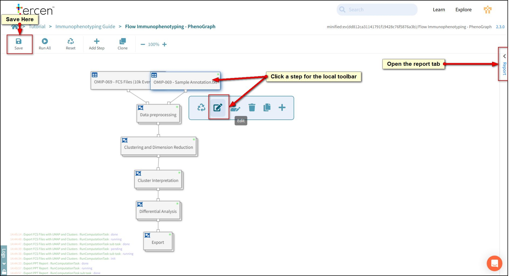
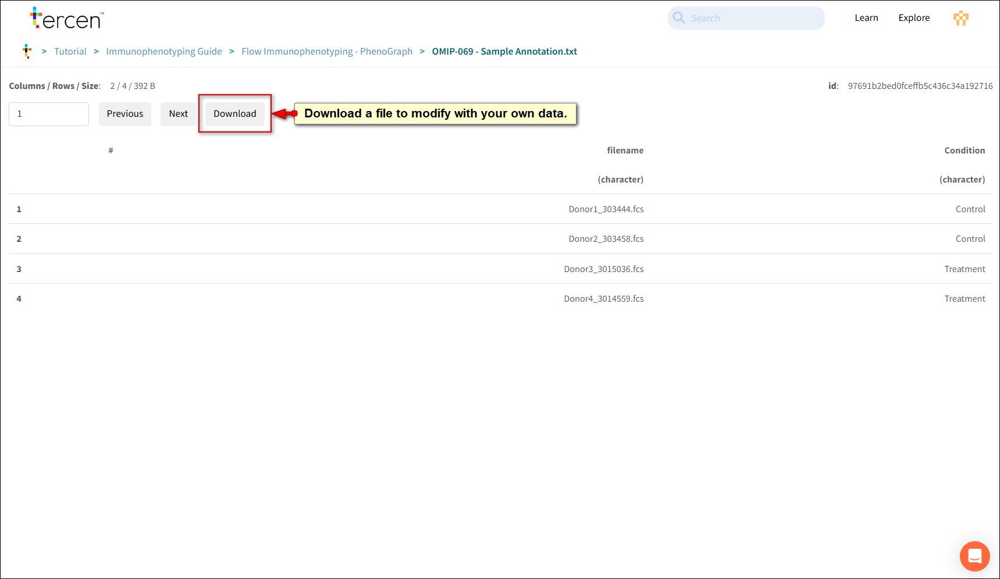

# Using your own files

This chapter explains how to use your own FCS siles with the Immunophenotyping - Phenograph template.

## ZIP the FCS files

Compress all FCS files into a ZIP file.

This can be done in your file browser or with a compression app such as 7.zip.

## Make an Annotation File

To make your own annotation file open the Flow **Immunophenotyping - PhenoGraph** workflow in the tutorial project.

Select the OMIP-069 - Sample Annotation and edit it using the local toolbar.

The annotation file is made up of two columns.

- filename
- Condition

Press the **Download** button

When the file downloads open it in your spreadsheet program (e.g Excel).

Change the filenames to match your FCS files and set the relevant condition for that file.

Save your changes and rename your file to something appropriate.

## Create a new project

Follow the procedure in Chapter 1 to create a new project.

Upload the ZIP file with **Upload File** button

Upload the Annotation file using the **Import Data** button.

Choose the CSV importer

### Run the Template

Follow the **New Workflow** procedure as per Chapter 1.

Be sure to select the **Flow Immunophenotyping - PhenoGraph** template.

Press **Run All**.

Select your own files for the analysis.

### Channel Descriptions

The **Channel Names and descriptions** section of the report assumes that the FCS files have been cleaned.

If the Channel descriptions do not match your expectations we recommend you rename in your gating software and re-upload the files.
